# Sustainable AI - System Architecture

This document provides the system architecture diagrams for the Sustainable AI Energy Monitor application.

## Performance Summary (December 2025) - Professional Standards Achieved! ✅

| Metric              | Target    | Achieved              | Notes                                |
| ------------------- | --------- | --------------------- | ------------------------------------ |
| **R² Score**        | > 0.80    | **0.9813**            | Gradient Boosting, calibrated model  |
| **MAPE**            | < 25%     | **6.8%**              | Mean Absolute Percentage Error       |
| **Prediction Bias** | 0.90-1.10 | **0.9988**            | Near-perfect calibration             |
| **Correlation**     | > 0.85    | **0.9906**            | Pearson correlation coefficient      |
| **Within 20%**      | > 70%     | **94.0%**             | Predictions within 20% of actual     |
| Training Data       | -         | 2,600 samples         | Hybrid: synthetic + real + augmented |
| Validation Data     | -         | 100 real measurements | Actual energy measurements           |
| Optimization        | -         | **8-43% savings**     | 7 simplification strategies          |
| Test Coverage       | -         | **283 tests**         | 100% pass rate                       |

## High-Level Architecture

### Unit Convention

**Primary Unit: Joules (J)** - The model predicts energy in Joules, appropriate for per-prompt energy consumption.

| Unit Conversion | Value            |
| --------------- | ---------------- |
| 1 kWh           | 3,600,000 Joules |
| 1 J             | 2.78e-7 kWh      |

### Energy Level Thresholds (Science-Backed)

**Derived from 100 real energy measurements using CodeCarbon:**

| Level         | Joules | Source Data                             |
| ------------- | ------ | --------------------------------------- |
| **Low**       | ≤ 10 J | Simple prompts: 3.4-10.6 J (mean 5.7)   |
| **Medium**    | ≤ 25 J | Medium prompts: 10.3-20.1 J (mean 13.8) |
| **High**      | ≤ 50 J | Long prompts: 25.5-36.1 J (mean 29.6)   |
| **Very High** | > 50 J | Very long: 42.9-73.2 J (mean 51.9)      |

### Carbon Display

Carbon is displayed in **milligrams (mg CO₂)** for human readability:

- Example: "1.03 mg CO₂" instead of "1.03e-06 kg CO₂"


## Detailed Component Architecture


## Data Flow Diagram


## Module Dependency Graph


## EU Compliance Reporting Flow

```mermaid
flowchart LR
    subgraph DataCollection["📊 Data Collection"]
        Logs["Energy Logs"]
        Metrics["Usage Metrics"]
        Anomalies["Anomaly Records"]
    end

    subgraph Processing["⚙️ Processing"]
        Aggregate["Aggregate Stats"]
        Calculate["Calculate Impact"]
        Validate["Validate Data"]
    end

    subgraph Report["📋 Report Generation"]
        Summary["Summary Stats"]
        Environmental["Environmental Impact"]
        Compliance["Compliance Status"]
    end

    subgraph Output["📤 Output"]
        JSON["JSON Export"]
        CSV["CSV Export"]
        Display["Dashboard Display"]
    end

    DataCollection --> Processing
    Processing --> Report
    Report --> Output
```



## Technology Stack


## Supervised Learning Pipeline (Energy Prediction)


### Calibration Formula (Derived from Real Measurements)

```
Energy (Joules) = 9.27 + 0.331 × token_count
```

(R² = 0.871 on 100 real measurements)

### Training Data Composition

- **2,000 synthetic samples**: Generated with calibrated formula
- **100 real measurements**: Actual energy measurements from inference
- **500 augmented samples**: Variations of real measurements
- **Total: 2,600 samples** for production model

## Energy Scaling for Real-World Prompts

The ML model was trained on prompts with 5–24 tokens (mean: 11 tokens). To accurately predict energy for longer prompts used in production, scaling functions are applied:

### Token Scaling

```mermaid
flowchart LR
    subgraph Input["Input Prompt"]
        Tokens["Token Count"]
    end

    subgraph Decision{"Token Count > 25?"}
    end

    subgraph Scaling["Token Scaling"]
        Formula["scale = √(tokens / 15)"]
        Cap["Max: 10x"]
    end

    subgraph Output["Final Energy"]
        Base["Base ML Prediction"]
        Scaled["Scaled Energy"]
    end

    Tokens --> Decision
    Decision -->|No| Base
    Decision -->|Yes| Scaling
    Scaling --> Scaled
```

| Token Range  | Scaling Factor | Example                    |
| ------------ | -------------- | -------------------------- |
| 1–25 tokens  | 1.0x           | Base ML prediction         |
| 60 tokens    | ~2.0x          | √(60/15) = 2.0             |
| 135 tokens   | ~3.0x          | √(135/15) = 3.0            |
| 240 tokens   | ~4.0x          | √(240/15) = 4.0            |
| 1500+ tokens | 10.0x (capped) | Maximum scaling protection |

### Model Configuration Scaling

UI parameters (layers, training hours, FLOPs) apply multiplicative scaling:

```mermaid
flowchart LR
    subgraph Config["Model Configuration"]
        Layers["Layers (e.g., 48)"]
        Hours["Training Hours (e.g., 16)"]
        FLOPs["FLOPs/hour (e.g., 1e12)"]
    end

    subgraph Scaling["Scaling Functions"]
        LayerScale["√(layers/24)"]
        HourScale["log₁₀(hours+1)/log₁₀(9)"]
        FLOPScale["log₁₀(flops)/log₁₀(10¹¹)"]
    end

    subgraph Output["Combined Factor"]
        Multiply["layer × hour × flop"]
    end

    Config --> Scaling
    Scaling --> Multiply
```



**Design Rationale:**

- **Square-root scaling (tokens, layers)**: Sub-linear relationship—doubling input doesn't double energy
- **Logarithmic scaling (hours, FLOPs)**: Diminishing returns for extremely large values
- **10x cap**: Prevents unrealistic predictions for edge cases

## Unsupervised Learning Pipeline (Anomaly Detection)


---

## Key Components Summary

| Component         | Purpose                        | ML Type           | Performance              |
| ----------------- | ------------------------------ | ----------------- | ------------------------ |
| Parser            | Extract 6 core features        | N/A               | -                        |
| Complexity Scorer | Calculate prompt complexity    | Rule-based        | -                        |
| Energy Predictor  | Estimate energy consumption    | Supervised (GB)   | **R²=0.9813, MAPE=6.8%** |
| Anomaly Detector  | Flag unusual prompts           | Unsupervised (IF) | -                        |
| Text Simplifier   | Simplify verbose prompts       | Rule-based NLP    | **8-43% reduction**      |
| Prompt Optimizer  | Suggest efficient alternatives | Hybrid            | -                        |
| Model Validator   | Validate against real data     | N/A               | **94% within 20%**       |
| Database          | Store logs and reports         | N/A               | -                        |
| GUI               | User interface                 | N/A               | -                        |

## Training Data Summary

| Metric            | Original  | Improved (Calibrated) |
| ----------------- | --------- | --------------------- |
| Samples           | 50        | **2,600**             |
| Real measurements | 0         | **100**               |
| Features          | 7         | **6 core**            |
| Token range       | Unknown   | **5–24** (training)   |
| Token mean        | Unknown   | **11**                |
| Model R²          | 0.51-0.57 | **0.9813**            |
| MAPE              | Unknown   | **6.8%**              |
| Prediction Bias   | Unknown   | **0.9988**            |
| Within 20%        | Unknown   | **94.0%**             |

**Note**: For prompts exceeding 25 tokens, token-based scaling is applied (see "Energy Scaling for Real-World Prompts" section above).

---

_Generated for CSCN8010 Final Project - Sustainable AI Energy Monitor_
_Last Updated: December 2025_
